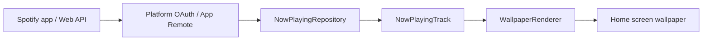

# Architecture (first slice)

## Product boundaries

- **Spotify only** — no Apple Music or other providers.
- **Wallpaper only** — display album art, title, and artist; no transport controls on the wallpaper or primary preview.
- Credentials come from local config or platform OAuth flows documented by Spotify; nothing sensitive is stored in git.

## Repository layout

```
shared/domain/     # Kotlin JVM: NowPlayingTrack, wallpaper layout model, formatting
android/           # Jetpack Compose app + Android wallpaper pipeline (stubbed)
ios/               # SwiftUI app + wallpaper export pipeline (stubbed)
```

## Data flow (target)



**First slice:** `StubNowPlayingRepository` feeds sample tracks into the preview UI. Spotify SDK wiring and wallpaper installation are explicit TODOs in code.

## Android (planned)

1. Authenticate via Spotify Android SDK / documented sign-in.
2. Poll or subscribe to currently playing metadata.
3. Render bitmap (art + text) and push to `WallpaperManager` or a `WallpaperService` (live wallpaper TBD).

## iOS (planned)

1. Authenticate via Spotify iOS SDK.
2. Fetch now-playing metadata.
3. Render UIImage and save or apply via supported APIs (Shortcuts / Photo Library / future WallpaperKit as applicable).

iOS third-party apps cannot set system wallpaper programmatically the same way as Android; the app focuses on generating the wallpaper image first, then user-driven application.
